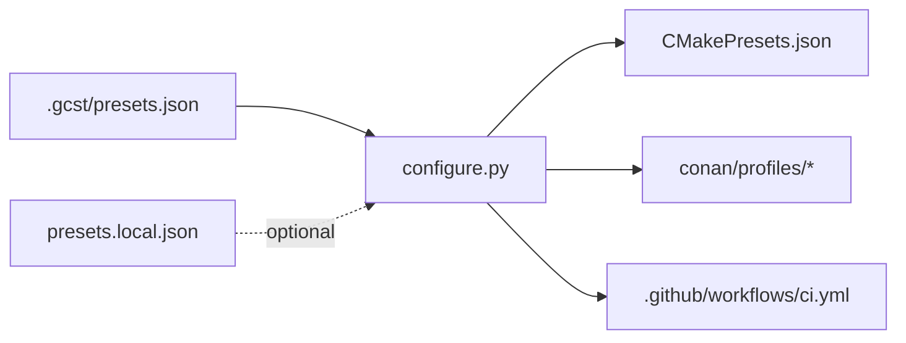

<div align="center">

# gcstemplate

**A cross-platform C++23 project template where one preset file drives CMake, Conan 2 and GitHub Actions across seven toolchains.**

[](https://github.com/Gaymocoder/gcstemplate/actions/workflows/ci.yml)
[](https://github.com/Gaymocoder/gcstemplate/tags)


[Quick start](#quick-start) · [Documentation](#documentation) · [Releases](https://github.com/Gaymocoder/gcstemplate/releases)

</div>

---

gcstemplate is a starting point for C++ projects that have to build everywhere from the first commit. Every toolchain is described **once**, in `.gcst/presets.json`. A generator turns that description into CMake presets, Conan profiles and the GitHub Actions build matrix, and a single `build.sh` / `build.bat` call takes a clean checkout all the way to a binary. The template can also live in your repository as a git submodule and pull its own updates in.

## Table of contents

- [Highlights](#highlights)
- [Quick start](#quick-start)
  - [Prerequisites](#prerequisites)
  - [Build the demo](#build-the-demo)
- [Toolchains](#toolchains)
- [How it works](#how-it-works)
- [Usage](#usage)
  - [Building](#building)
  - [Presets](#presets)
  - [Dependencies](#dependencies)
  - [Adding your code](#adding-your-code)
  - [Continuous integration](#continuous-integration)
  - [Template updates](#template-updates)
- [Documentation](#documentation)
- [Demo project](#demo-project)

## Highlights

- **One source of truth.** A preset holds its CMake configuration, its Conan profile and the CI steps that install its compiler. Add a preset, and it works locally and in CI at once.
- **Seven toolchains out of the box.** GCC and Clang with libstdc++ or libc++ on Linux; MSVC, MinGW-w64 GCC, Clang on the MSVC runtime and Clang on MinGW on Windows.
- **One-command builds.** Generate, install dependencies, configure and build — with a remembered default preset and a distinct exit code for every stage.
- **Machine-local presets.** Add, replace, deep-merge, import or remove presets by name or by regular expression, without touching the shared file.
- **Warnings that matter.** Curated flag sets for GCC, Clang and MSVC. With `GCST_WERROR=ON` significant warnings become errors, noisy ones stay warnings.
- **Conan 2 built in.** Dependencies are one line in `conanfile.py`; your own recipes in `recipes/` are exported automatically.
- **CI with per-commit verdicts.** A full matrix with a Conan cache and a drift check. Results are attached to every commit as git notes, readable right in `git log`.
- **Self-updating.** Keep the template as a submodule, and one script copies new versions of its files into your project.

## Quick start

### Prerequisites

| Tool | Version | Notes |
|---|---|---|
| Python | 3.12+ | with `conan` and `ruamel.yaml`: `pip install conan ruamel.yaml` |
| CMake | 3.31+ | |
| Conan | 2.x | a default profile must exist: `conan profile detect` |
| Git | any recent | |
| Compilers | — | only for the presets you build, see [Toolchains](#toolchains) |

### Build the demo

Linux:

```sh
git clone https://github.com/Gaymocoder/gcstemplate.git my-project
cd my-project
pip install conan ruamel.yaml
conan profile detect
sh build.sh --preset unix-gcc-libstdc++
./bin/GCST.Hello
```

Windows, with MinGW-w64 GCC in `PATH`:

```bat
git clone https://github.com/Gaymocoder/gcstemplate.git my-project
cd my-project
pip install conan ruamel.yaml
conan profile detect
build.bat --preset win64-gcc-libstdc++
bin\GCST.Hello.exe
```

The preset is remembered, so the next build is just `sh build.sh` or `build.bat`. What you just built is described in [Demo project](#demo-project).

<p align="right"><a href="#table-of-contents">↑ Contents</a></p>

## Toolchains

| Preset | OS | Compiler | Standard library | Needs locally |
|---|---|---|---|---|
| `unix-clang-libc++` | Linux | Clang 22 + lld | libc++ | Clang 22, lld, libc++ / libc++abi 22 |
| `unix-gcc-libstdc++` | Linux | GCC 14 | libstdc++ | GCC 14 |
| `unix-clang-libstdc++` | Linux | Clang 22 + lld | libstdc++ | Clang 22, lld, GCC 14 |
| `win64-gcc-libstdc++` | Windows | MinGW-w64 GCC 14.2 | libstdc++ | MinGW-w64 in `PATH` |
| `win64-clang-libstdc++` | Windows | Clang 20 + lld | libstdc++ (MinGW) | LLVM 20, MinGW-w64 in `PATH` |
| `win64-msvc-msvcstl` | Windows | MSVC 19.5 | MSVC STL | Visual Studio 2026 |
| `win64-clang-msvc` | Windows | clang-cl 20 | MSVC STL | LLVM 20, MSVC developer environment |

All presets build the `Release` configuration. How each one installs its toolchain in CI — a ready recipe for setting up a machine — is shown in [its `github_ci` section](docs/presets.md#the-github_ci-section).

<p align="right"><a href="#table-of-contents">↑ Contents</a></p>

## How it works



Presets are expanded into CMake presets, Conan profiles and the CI matrix before every build, so the three never drift apart. The full picture — which files are generated, which are yours, and where everything lives — is in [Architecture](docs/architecture.md).

<p align="right"><a href="#table-of-contents">↑ Contents</a></p>

## Usage

### Building

Run from the repository root; on Windows use `build.bat` with the same arguments.

```sh
sh build.sh --preset unix-clang-libc++   # build a preset
sh build.sh                              # build the last used preset again
sh build.sh --clear                      # delete build/ and bin/ first
sh build.sh --verbose                    # show full compiler command lines
GCST_WERROR=ON sh build.sh               # turn significant warnings into errors
```

Executables land in `bin/`, static libraries in `build/lib/`.

📖 All options, build stages and exit codes: [Building](docs/build.md).

### Presets

Base presets live in `.gcst/presets.json`. Presets of your own go into `presets.local.json` in the repository root: it can add new presets and change or drop the base ones.

```json
{
    ".remove": "^win64",
    "unix-gcc-libstdc++": {
        ".merge": true,
        "cmake": {
            "cacheVariables": {
                "CMAKE_EXPORT_COMPILE_COMMANDS": "ON"
            }
        }
    }
}
```

This drops every Windows preset and makes the GCC preset emit `compile_commands.json`. Local presets reshape the CI matrix too: if they are meant for your machine only, build with `--no-ghci`.

📖 [Presets](docs/presets.md) — the preset format · [Local presets](docs/local-presets.md) — everything `presets.local.json` can do.

### Dependencies

Add a requirement to `conanfile.py` and find it from CMake as usual:

```python
requires = (
    "boost/1.87.0",
    "fmt/10.2.1",
)
```

```cmake
find_package(fmt REQUIRED)
target_link_libraries(my_app PRIVATE fmt::fmt)
```

Recipes of your own go into `recipes/<package>/` and are exported automatically.

📖 [Dependencies](docs/dependencies.md).

### Adding your code

Register a subdirectory in the root `CMakeLists.txt`, then prepare targets with the template's helpers — they add include paths, warnings and per-configuration optimization. A library assembled from object modules gets its `prefix::module` alias automatically:

```cmake
add_library(my_lib_core OBJECT src/core.cpp)
gcst_binary_prepare(my_lib_core)

add_library(my_lib STATIC)
gcst_export_prepare(my_lib my_lib_core)   # → my::lib
```

An executable using it:

```cmake
add_executable(my_app src/main.cpp)
target_link_libraries(my_app PRIVATE my::lib)
gcst_binary_prepare(my_app)
```

📖 [CMake modules](docs/cmake.md).

### Continuous integration

Every push builds all presets on GitHub Actions, and the result for each preset is attached to the commit as a git note:

```sh
git fetch origin 'refs/notes/*:refs/notes/*'
git log --notes=ci
```

📖 [Continuous integration](docs/ci.md).

### Template updates

Keep the template as a submodule and let the updater copy its new versions into your project:

```sh
git submodule add https://github.com/Gaymocoder/gcstemplate.git external/gcstemplate
python3 external/gcstemplate/scripts/gcst_update.py

# later
git submodule update --remote external/gcstemplate
python3 external/gcstemplate/scripts/gcst_update.py
```

Updated files are replaced, not merged — keep your presets in `presets.local.json`.

📖 [Updating the template](docs/updating.md).

<p align="right"><a href="#table-of-contents">↑ Contents</a></p>

## Documentation

| Document | Covers |
|---|---|
| [Architecture](docs/architecture.md) | How the pieces fit, generated and handwritten files, repository layout |
| [Building](docs/build.md) | Build scripts, every option, default preset, stages and exit codes, output layout, running the generator alone |
| [Presets](docs/presets.md) | Preset format: `cmake`, `conan` and `github_ci` sections, CI service keys, adding a preset |
| [Local presets](docs/local-presets.md) | Adding, replacing, merging, importing and removing presets; keeping CI in sync |
| [Dependencies](docs/dependencies.md) | `conanfile.py`, how `conan install` runs, local recipes |
| [CMake modules](docs/cmake.md) | Project conventions, target helpers, warning sets, optimization flags |
| [Continuous integration](docs/ci.md) | Triggers, build job, Conan cache, verdict notes |
| [Updating the template](docs/updating.md) | Submodule setup, what the updater changes, install-only files |
| [Scripting](docs/scripting.md) | The `gcst` Python package for your own tooling |

## Demo project

The template ships a small project that exercises the whole chain on every toolchain. Replace it with your own code.

- **`utils/`** — the `gcst_utils` static library, linked as `gcst::utils`. It provides `gcst::utils::exstd::exe_path()`, the absolute path of the running executable on Windows and Linux.
- **`hello/`** — the `GCST.Hello` executable, showing off C++23 `std::print` formatting and Boost.Algorithm string utilities pulled in through Conan.

<p align="right"><a href="#table-of-contents">↑ Contents</a></p>
