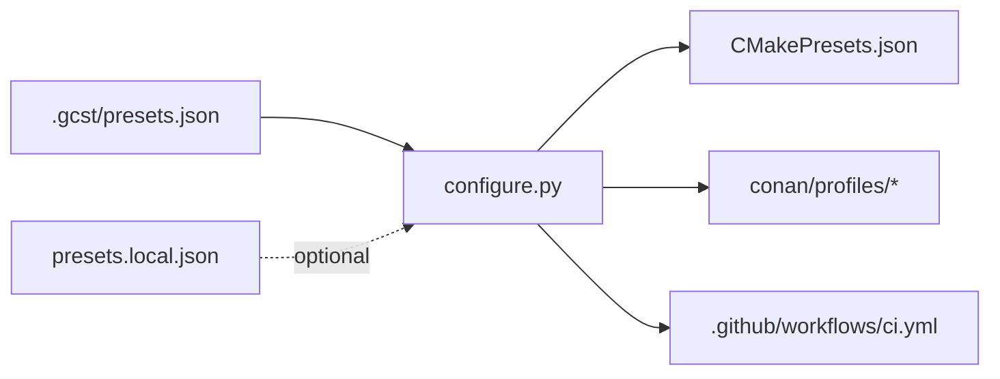

<div align="center">

# gcstemplate

**A cross-platform C++23 project template where one preset file drives CMake, Conan 2 and GitHub Actions across eight toolchains.**

[](https://github.com/Gaymocoder/gcstemplate/actions/workflows/ci.yml)
[](https://github.com/Gaymocoder/gcstemplate/tags)


[Quick start](#quick-start) · [Documentation](#documentation) · [Releases](https://github.com/Gaymocoder/gcstemplate/releases)

</div>

---

gcstemplate is a starting point for C++ projects that have to build everywhere from the first commit. Every toolchain is described **once**, in `.gcst/presets.json`. A generator turns that description into CMake presets, Conan profiles and the GitHub Actions build matrix, and a single `build.sh` / `build.bat` call takes a clean checkout all the way to a binary. The template can also live in your repository as a git submodule and pull its own updates in.

## Table of contents

- [Highlights](#highlights)
- [Quick start](#quick-start)
  - [Prerequisites](#prerequisites)
  - [Build the demo](#build-the-demo)
- [Toolchains](#toolchains)
- [How it works](#how-it-works)
- [Usage](#usage)
  - [Building](#building)
  - [Presets](#presets)
  - [Dependencies](#dependencies)
  - [Adding your code](#adding-your-code)
  - [Settings](#settings)
  - [Continuous integration](#continuous-integration)
  - [Template updates](#template-updates)
- [Documentation](#documentation)
- [Demo project](#demo-project)

## Highlights

- **One source of truth.** A preset holds its CMake configuration, its Conan profile and the CI steps that install its compiler. Add a preset, and it works locally and in CI at once.
- **Eight toolchains out of the box.** GCC and Clang with libstdc++ or libc++ on Linux; MSVC, MinGW-w64 GCC, and Clang on the MSVC runtime, on MinGW or with libc++ on Windows.
- **Toolchain versions in one place.** The `.vars` key holds a version per compiler, separately for your machine and for CI, and the CI install steps follow it.
- **One-command builds.** Generate, install dependencies, configure and build — with a remembered default preset and a distinct exit code for every stage.
- **Machine-local presets.** Add, replace, deep-merge, import or remove presets by name or by regular expression, without touching the shared file.
- **Warnings that matter.** Curated flag sets for GCC, Clang and MSVC. With `GCST_WERROR=ON` significant warnings become errors, noisy ones stay warnings.
- **Conan 2 built in.** Dependencies are one line in `conanfile.py`; your own recipes in `recipes/` are exported automatically.
- **Settings out of the box.** `gcst::settings` reads defaults, a config file and the command line through CLI11 in one call, and an application adds settings of its own by inheriting from it.
- **CI with per-commit verdicts.** A full matrix with a Conan cache and a drift check. Results are attached to every commit as git notes, readable right in `git log`.
- **Self-updating.** Keep the template as a submodule, and `build.sh --update` pulls its latest release into your project — files the template dropped are removed too.

## Quick start

### Prerequisites

| Tool | Version | Notes |
|---|---|---|
| Python | 3.12+ | with `conan` and `ruamel.yaml`: `pip install conan ruamel.yaml` |
| CMake | 3.31+ | |
| Conan | 2.x | a default profile must exist: `conan profile detect` |
| Git | any recent | |
| Compilers | — | only for the presets you build, see [Toolchains](#toolchains) |

### Build the demo

Linux:

```sh
git clone https://github.com/Gaymocoder/gcstemplate.git my-project
cd my-project
pip install conan ruamel.yaml
conan profile detect
sh build.sh --preset unix-gcc-libstdc++
./bin/GCST.Hello
```

Windows, with MinGW-w64 GCC in `PATH`:

```bat
git clone https://github.com/Gaymocoder/gcstemplate.git my-project
cd my-project
pip install conan ruamel.yaml
conan profile detect
build.bat --preset win64-gcc-libstdc++
bin\GCST.Hello.exe
```

The preset is remembered, so the next build is just `sh build.sh` or `build.bat`. What you just built is described in [Demo project](#demo-project).

<p align="right"><a href="#table-of-contents">↑ Contents</a></p>

## Toolchains

| Preset | OS | Compiler | Standard library | Needs locally |
|---|---|---|---|---|
| `unix-gcc-libstdc++` | Linux | GCC | libstdc++ | GCC |
| `unix-clang-libc++` | Linux | Clang + lld | libc++ | Clang, lld, libc++ / libc++abi |
| `unix-clang-libstdc++` | Linux | Clang + lld | libstdc++ | Clang, lld, GCC |
| `win64-msvc-msvcstl` | Windows | MSVC | MSVC STL | Visual Studio |
| `win64-gcc-libstdc++` | Windows | MinGW-w64 GCC | libstdc++ | MinGW-w64 in `PATH` |
| `win64-clang-msvc` | Windows | clang-cl | MSVC STL | LLVM, MSVC developer environment |
| `win64-clang-libstdc++` | Windows | Clang + lld | libstdc++ (MinGW) | LLVM and MinGW-w64 in `PATH` |
| `win64-clang-libc++` | Windows | Clang + lld (llvm-mingw) | libc++ | llvm-mingw in `PATH` |

All presets build the `Release` configuration, or `Debug` with `--debug`. Which compiler versions they ask for — currently GCC 16.1.0, Clang 19.1.7 and MSVC 19.44 — is set in one place and can be changed per machine, see [Toolchain versions](docs/presets.md#toolchain-versions). How each preset installs its toolchain in CI, a ready recipe for setting up a machine, is shown in [its `github_ci` section](docs/presets.md#the-github_ci-section).

<p align="right"><a href="#table-of-contents">↑ Contents</a></p>

## How it works


```mermaid
flowchart LR
    P[".gcst/presets.json"] --> G["configure.py"]
    L["presets.local.json"] -.->|optional| G
    G --> CM["CMakePresets.json"]
    G --> CO["conan/profiles/*"]
    G --> CI[".github/workflows/ci.yml"]
```

Presets are expanded into CMake presets, Conan profiles and the CI matrix before every build, so the three never drift apart. The full picture — which files are generated, which are yours, and where everything lives — is in [Architecture](docs/architecture.md).

<p align="right"><a href="#table-of-contents">↑ Contents</a></p>

## Usage

### Building

Run from the repository root; on Windows use `build.bat` with the same arguments.

```sh
sh build.sh --preset unix-clang-libc++   # build a preset
sh build.sh                              # build the last used preset again
sh build.sh --clear                      # delete build/ and bin/ first
sh build.sh --debug                      # build Debug instead of Release
sh build.sh --verbose                    # show full compiler command lines
GCST_WERROR=ON sh build.sh               # turn significant warnings into errors
GCST_SAMPLES_BUILD=OFF sh build.sh       # skip the samples
```

Executables land in `bin/`, static libraries in `build/lib/`.

📖 All options, build stages and exit codes: [Building](docs/build.md).

### Presets

Base presets live in `.gcst/presets.json`, together with the toolchain versions they build with. Presets of your own go into `presets.local.json` in the repository root: it can add new presets, change or drop the base ones, and override the versions for your machine.

```json
{
    ".remove": "^win64",
    "unix-gcc-libstdc++": {
        ".merge": true,
        "cmake": {
            "cacheVariables": {
                "CMAKE_EXPORT_COMPILE_COMMANDS": "ON"
            }
        }
    }
}
```

This drops every Windows preset and makes the GCC preset emit `compile_commands.json`. Local presets reshape the CI matrix too: if they are meant for your machine only, build with `--no-ghci`.

📖 [Presets](docs/presets.md) — the preset format · [Local presets](docs/local-presets.md) — everything `presets.local.json` can do.

### Dependencies

Add a requirement to `conanfile.py`, after the template's own ones, and find it from CMake as usual:

```python
requires = (
    *gcstDeps.requires,   # the template's dependencies, kept up to date by --update
    "boost/1.87.0",
    "fmt/10.2.1",
)
```

```cmake
find_package(fmt REQUIRED)
target_link_libraries(my_app PRIVATE fmt::fmt)
```

Recipes of your own go into `recipes/<package>/` and are exported automatically.

📖 [Dependencies](docs/dependencies.md).

### Adding your code

Register a subdirectory in the root `CMakeLists.txt`, then prepare targets with the template's helpers — they add include paths, warnings and per-configuration optimization. A library assembled from object modules gets its `prefix::module` alias automatically:

```cmake
add_library(my_lib_core OBJECT src/core.cpp)
gcst_binary_prepare(my_lib_core)

add_library(my_lib STATIC)
gcst_export_prepare(my_lib my_lib_core)   # → my::lib
```

An executable using it:

```cmake
add_executable(my_app src/main.cpp)
target_link_libraries(my_app PRIVATE my::lib)
gcst_binary_prepare(my_app)
```

📖 [CMake modules](docs/cmake.md).

### Settings

Link `gcst::utils` and initialize the settings at the start of `main`:

```cpp
#include <gcst/gcst.h>

int main(int argc, char** argv)
{
    if (auto r = gcst::settings::init(argc, argv); !r)
        return r.error();

    gcst::params->get("file-loglevel");   // default < settings.conf < command line
}
```

Settings of your own come from a class derived from `gcst::basic_settings<YourClass>`, initialized with `YourClass::init(argc, argv)`.

📖 [Settings](docs/settings.md).

### Continuous integration

Every push builds all presets on GitHub Actions, and the result for each preset is attached to the commit as a git note:

```sh
git fetch origin 'refs/notes/*:refs/notes/*'
git log --notes=ci
```

📖 [Continuous integration](docs/ci.md).

### Template updates

Keep the template as a submodule. The first install runs from the submodule, every later update from your repository root:

```sh
git submodule add -b stable https://github.com/Gaymocoder/gcstemplate.git external/gcstemplate
cd external/gcstemplate
sh build.sh --update      # first install
cd ../..

sh build.sh --update      # later: pull the latest release and update the project
```

The updater shows what it's about to replace, add or delete and asks before touching anything. Updated files are replaced, not merged — keep your presets in `presets.local.json`. Coming from v5? Follow [Migrating from v5](docs/updating.md#migrating-from-v5) once.

📖 [Updating the template](docs/updating.md).

<p align="right"><a href="#table-of-contents">↑ Contents</a></p>

## Documentation

| Document | Covers |
|---|---|
| [Architecture](docs/architecture.md) | How the pieces fit, generated and handwritten files, repository layout |
| [Building](docs/build.md) | Build scripts, every option, default preset, stages and exit codes, output layout, running the generator alone |
| [Presets](docs/presets.md) | Preset format: `cmake`, `conan` and `github_ci` sections, CI service keys, adding a preset |
| [Local presets](docs/local-presets.md) | Adding, replacing, merging, importing and removing presets; keeping CI in sync |
| [Dependencies](docs/dependencies.md) | `conanfile.py` and the template's base dependencies, how `conan install` runs, local recipes |
| [CMake modules](docs/cmake.md) | Project conventions, target helpers, warning sets, optimization flags |
| [Continuous integration](docs/ci.md) | Triggers, build job, Conan cache, verdict notes |
| [Updating the template](docs/updating.md) | Submodule setup, `--update` and `--local`, what gets replaced, added and deleted, the file lists, migrating from v5 |
| [Scripting](docs/scripting.md) | The `gcst` Python package for your own tooling |
| [Settings](docs/settings.md) | `gcst::settings`: sources and precedence, built-in options, the config file, extending by inheritance |

## Demo project

The template ships a small project that exercises the whole chain on every toolchain. Replace it with your own code.

- **`utils/`** — the `gcst_utils` static library, linked as `gcst::utils`, with its headers in `include/gcst/`; `<gcst/gcst.h>` includes all of them. It provides `gcst::utils::exstd::exe_path()`, the absolute path of the running executable on Windows and Linux, and the [settings module](docs/settings.md).
- **`hello/`** — the `GCST.Hello` executable. It initializes the settings from its command line and `bin/settings.conf` and prints them. Its showcase module also keeps a C++23 `std::print` and Boost.Algorithm demo, `gcst::showcase::std_print()`, not called by default.
- **`samples/`** — `samples.BasicSettings` and `samples.Mysettings`: the settings as they are, and extended by a derived class. Built unless `GCST_SAMPLES_BUILD=OFF`. See [Samples](docs/settings.md#samples).

<p align="right"><a href="#table-of-contents">↑ Contents</a></p>
