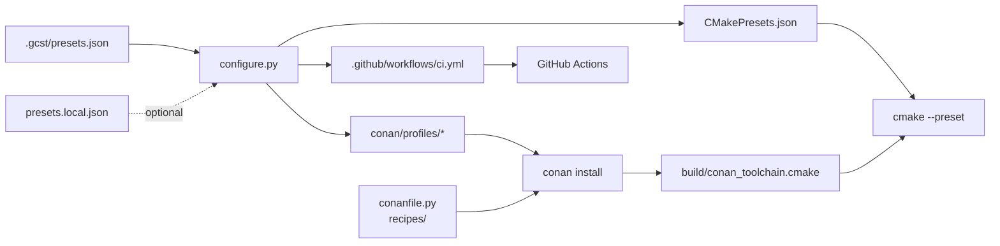

# Architecture

<sub>[README](../README.md) · [Architecture](architecture.md) · [Building](build.md) · [Presets](presets.md) · [Local presets](local-presets.md) · [Dependencies](dependencies.md) · [CMake modules](cmake.md) · [CI](ci.md) · [Updating](updating.md) · [Scripting](scripting.md)</sub>

How the parts of the template fit together, which files are generated and which are yours, and where everything lives.

- [Overview](#overview)
- [Generated and handwritten files](#generated-and-handwritten-files)
- [Repository layout](#repository-layout)

## Overview



A preset is written once, in [`.gcst/presets.json`](presets.md) or [`presets.local.json`](local-presets.md). Before every build, `configure.py` expands the presets into three artifacts:

- **`CMakePresets.json`** — one configure preset per preset, pointing CMake at the Conan toolchain;
- **`conan/profiles/<preset>`** — the Conan host profile the dependencies are installed with;
- **`.github/workflows/ci.yml`** — the build matrix and the steps installing each toolchain.

The build driver then installs dependencies with the matching profile and configures CMake with the matching preset — see [Building](build.md#stages-and-exit-codes). GitHub Actions runs the same driver for every preset — see [Continuous integration](ci.md).

## Generated and handwritten files

| File | Produced by | In git |
|---|---|---|
| `CMakePresets.json` | `configure.py` | ignored |
| `CMakeUserPresets.json` | Conan | ignored |
| `conan/profiles/*` | `configure.py` | ignored |
| `ci.yml`: `jobs.build.steps`, `jobs.build.strategy.matrix.include` | `configure.py` | committed |
| `ci.yml`: everything else — `name`, `on`, job `env`, `runs-on`, `fail-fast`, the `notes` job | handwritten, preserved on regeneration | committed |
| `.gcst/.default` | `build.py` | ignored |
| `build/`, `bin/` | the build | ignored |

`ci.yml` is committed because GitHub reads workflows from the repository. The generator replaces only the two generated nodes, so edits to the rest of the file survive regeneration. CI fails when the committed file doesn't match the generated one — see [Keeping CI in sync](local-presets.md#keeping-ci-in-sync).

## Repository layout

```
.
├── .gcst/
│   ├── gcst/                    shared Python package
│   ├── scripts/
│   │   ├── build.py             build driver
│   │   └── configure.py         preset generator
│   └── presets.json             base presets
├── .github/workflows/
│   ├── ci.yml                   CI workflow (partly generated)
│   └── scripts/                 toolchain installers for CI
├── cmake/gcst/
│   ├── utils.cmake              target helpers
│   └── warnings.cmake           warning and optimization sets
├── docs/                        this documentation
├── scripts/
│   ├── gcst_update.py           template updater
│   └── .gcstu-install-only      files installed only once
├── include/gcst/                public headers of the demo
├── hello/                       demo executable
├── utils/                       demo library
├── build.sh                     Linux entry point
├── build.bat                    Windows entry point
├── conanfile.py                 dependencies
└── CMakeLists.txt               root project
```

| Path | Described in |
|---|---|
| `.gcst/gcst/` | [Scripting](scripting.md) |
| `.gcst/scripts/build.py`, `build.sh`, `build.bat` | [Building](build.md) |
| `.gcst/scripts/configure.py`, `.gcst/presets.json` | [Presets](presets.md) |
| `.github/workflows/` | [Continuous integration](ci.md) |
| `cmake/gcst/`, `CMakeLists.txt` | [CMake modules](cmake.md) |
| `scripts/` | [Updating the template](updating.md) |
| `conanfile.py` | [Dependencies](dependencies.md) |
| `include/`, `hello/`, `utils/` | [Demo project](../README.md#demo-project) |
