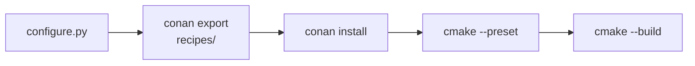

# Building

<sub>[README](../README.md) · [Architecture](architecture.md) · [Building](build.md) · [Presets](presets.md) · [Local presets](local-presets.md) · [Dependencies](dependencies.md) · [CMake modules](cmake.md) · [CI](ci.md) · [Updating](updating.md) · [Scripting](scripting.md)</sub>

Everything about producing a binary: the build scripts, their options, the stages a build goes through and where the results land.

- [Entry points](#entry-points)
- [Options](#options)
- [Default preset](#default-preset)
- [Stages and exit codes](#stages-and-exit-codes)
- [Warnings as errors](#warnings-as-errors)
- [Output](#output)
- [Running the generator alone](#running-the-generator-alone)

## Entry points

`build.sh` (Linux) and `build.bat` (Windows) are thin wrappers. They default `GCST_WERROR` to `OFF`, put `.gcst/` on `PYTHONPATH` and pass every argument to `.gcst/scripts/build.py`. Run them from the repository root, and use them rather than `build.py` directly: the driver relies on the environment they set.

```sh
sh build.sh [options]
build.bat [options]
```

## Options

| Option | Description |
|---|---|
| `-p`, `--preset <name>` | Preset to build — one of the [base presets](../README.md#toolchains) or your [local presets](local-presets.md). When omitted, the [default preset](#default-preset) is used |
| `-c`, `--clear` | Delete `build/` and `bin/` before building |
| `-v`, `--verbose` | Pass `--verbose` to `cmake --build` |
| `-pl`, `--presets-local <path>` | Read local presets from this file instead of `presets.local.json` — see [Using another file](local-presets.md#using-another-file) |
| `-il`, `--ignore-local` | Ignore local presets entirely |
| `--no-conan` | Skip generating Conan profiles, [exporting recipes](dependencies.md#local-recipes) and `conan install` |
| `--no-cmake` | Skip generating `CMakePresets.json`, CMake configure and build |
| `--no-ghci` | Don't regenerate `.github/workflows/ci.yml` — see [Keeping CI in sync](local-presets.md#keeping-ci-in-sync) |

## Default preset

Every build that reaches the Conan stage stores its preset name in `.gcst/.default`, which is ignored by git. A build without `--preset` reads it from there; if the file doesn't exist either, the build stops with exit code `1`.

## Stages and exit codes

A build runs these stages in order and stops at the first one that fails:



Each stage fails with its own exit code and prints the command it ran.

| Code | Failed stage | Where to look |
|---|---|---|
| `0` | — (success) | |
| `1` | No preset given and no default preset remembered | [Default preset](#default-preset) |
| `2` | Generating presets (`configure.py`) | [Presets](presets.md), [Local presets](local-presets.md) |
| `3` | Unknown preset: no Conan profile with that name | [Toolchains](../README.md#toolchains) |
| `4` | Exporting local recipes | [Local recipes](dependencies.md#local-recipes) |
| `5` | `conan install` | [Dependencies](dependencies.md) |
| `6` | CMake configure | [The `cmake` section](presets.md#the-cmake-section), [CMake modules](cmake.md) |
| `7` | CMake build | your code, [Warnings](cmake.md#warnings) |

The CMake build always runs as `cmake --build build --config Release`.

## Warnings as errors

The `GCST_WERROR` environment variable is forwarded to CMake as `-DGCST_WARNINGS_AS_ERRORS` on **every** configure, so the value never sticks in `CMakeCache.txt` between builds:

```sh
GCST_WERROR=ON sh build.sh
```

```bat
set GCST_WERROR=ON
build.bat
```

Which warnings become errors is described in [Warnings](cmake.md#warnings).

## Output

| Path | Contents |
|---|---|
| `build/` | Conan-generated files and the CMake binary directory |
| `build/lib/` | Static libraries |
| `bin/` | Executables. Multi-config generators (Visual Studio) add a per-configuration subdirectory, e.g. `bin/Release/` |

Both directories are ignored by git and removed by `--clear`. The layout is set in the root `CMakeLists.txt` — see [Project conventions](cmake.md#project-conventions).

## Running the generator alone

Every build regenerates presets first. To regenerate without building:

```sh
PYTHONPATH=.gcst python3 .gcst/scripts/configure.py
```

It accepts `-pl`, `-il`, `--no-cmake`, `--no-conan` and `--no-ghci` with the same meaning as in [Options](#options). What it produces is listed in [Generated and handwritten files](architecture.md#generated-and-handwritten-files).
