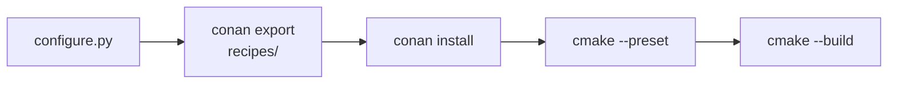

# Building

<sub>[README](../README.md) · [Architecture](architecture.md) · [Building](build.md) · [Presets](presets.md) · [Local presets](local-presets.md) · [Dependencies](dependencies.md) · [CMake modules](cmake.md) · [CI](ci.md) · [Updating](updating.md) · [Scripting](scripting.md) · [Settings](settings.md)</sub>

Everything about producing a binary: the build scripts, their options, the stages a build goes through and where the results land. The same scripts also [update the template](updating.md).

- [Entry points](#entry-points)
- [Options](#options)
- [Default preset](#default-preset)
- [Stages and exit codes](#stages-and-exit-codes)
- [Build type](#build-type)
- [Warnings as errors](#warnings-as-errors)
- [Samples](#samples)
- [Output](#output)
- [Running the generator alone](#running-the-generator-alone)

## Entry points

`build.sh` (Linux) and `build.bat` (Windows) are thin wrappers. They default `GCST_WERROR` to `OFF`, put `.gcst/` on `PYTHONPATH` and pass every argument to `.gcst/scripts/build.py`. Run them from the repository root, and use them rather than `build.py` directly: the driver relies on the environment they set.

```sh
sh build.sh [options]
build.bat [options]
```

## Options

| Option | Description |
|---|---|
| `-p`, `--preset <name>` | Preset to build — one of the [base presets](../README.md#toolchains) or your [local presets](local-presets.md). When omitted, the [default preset](#default-preset) is used |
| `-c`, `--clear` | Delete `build/` and `bin/` before building |
| `-d`, `--debug` | Build the `Debug` configuration instead of `Release` — see [Build type](#build-type) |
| `-bs`, `--build-samples` | Build the samples even when `GCST_SAMPLES_BUILD` turns them off — see [Samples](#samples) |
| `-v`, `--verbose` | Pass `--verbose` to `cmake --build` |
| `-pl`, `--presets-local <path>` | Read local presets from this file instead of `presets.local.json` — see [Using another file](local-presets.md#using-another-file) |
| `-il`, `--ignore-local` | Ignore local presets entirely |
| `--no-conan` | Skip generating Conan profiles, [exporting recipes](dependencies.md#local-recipes) and `conan install` |
| `--no-cmake` | Skip generating `CMakePresets.json`, CMake configure and build |
| `--no-ghci` | Don't regenerate `.github/workflows/ci.yml` — see [Keeping CI in sync](local-presets.md#keeping-ci-in-sync) |
| `-u`, `--update` | Update the template instead of building — see [Updating the template](updating.md#updating). Build options are ignored |
| `--local` | With `--update`: don't pull the template submodule first |

## Default preset

Every build that reaches the Conan stage stores its preset name in `.gcst/.default`, which is ignored by git. A build without `--preset` reads it from there; if the file doesn't exist either, the build stops with exit code `2`.

## Stages and exit codes

A build runs these stages in order and stops at the first one that fails:


```mermaid
flowchart LR
    A["configure.py"] --> B["conan export<br/>recipes/"]
    B --> C["conan install"]
    C --> D["cmake --preset"]
    D --> E["cmake --build"]
```

Each stage fails with its own exit code and prints the command it ran.

| Code | Failed stage | Where to look |
|---|---|---|
| `0` | — (success) | |
| `1` | `--update`: pulling the template submodule or updating failed | [Updating the template](updating.md#updating) |
| `2` | No preset given and no default preset remembered | [Default preset](#default-preset) |
| `3` | Generating presets (`configure.py`) | [Presets](presets.md), [Local presets](local-presets.md) |
| `4` | Unknown preset: no Conan profile with that name | [Toolchains](../README.md#toolchains) |
| `5` | Exporting local recipes | [Local recipes](dependencies.md#local-recipes) |
| `6` | `conan install` | [Dependencies](dependencies.md) |
| `7` | CMake configure | [The `cmake` section](presets.md#the-cmake-section), [CMake modules](cmake.md) |
| `8` | CMake build | your code, [Warnings](cmake.md#warnings) |

## Build type

Every build is `Release`, or `Debug` with `--debug`. The driver passes the build type to all three tools on every run:

| Stage | Argument |
|---|---|
| `conan install` | `-s build_type=Release` or `Debug` |
| `cmake --preset` | `-DCMAKE_BUILD_TYPE=Release` or `Debug` |
| `cmake --build` | `--config Release` or `Debug` |

Command-line values take precedence over the preset, so the `build_type` in a preset's `conan` section and its `CMAKE_BUILD_TYPE` have no effect on a build — `--debug` is the only switch. Passing the type on every run also means it never sticks in `CMakeCache.txt`: a build without `--debug` after a debug one is `Release` again.

```sh
sh build.sh --debug
```

Which compiler flags each configuration gets is listed in [Optimization](cmake.md#optimization).

## Warnings as errors

The `GCST_WERROR` environment variable is forwarded to CMake as `-DGCST_WARNINGS_AS_ERRORS` on **every** configure, so the value never sticks in `CMakeCache.txt` between builds:

```sh
GCST_WERROR=ON sh build.sh
```

```bat
set GCST_WERROR=ON
build.bat
```

Which warnings become errors is described in [Warnings](cmake.md#warnings).

## Samples

The [settings samples](settings.md#samples) in `samples/` are built by default. The `GCST_SAMPLES_BUILD` environment variable turns them off:

```sh
GCST_SAMPLES_BUILD=OFF sh build.sh
```

```bat
set GCST_SAMPLES_BUILD=OFF
build.bat
```

| `GCST_SAMPLES_BUILD` | `--build-samples` | Samples |
|---|---|---|
| unset or `ON` | — | built |
| any other value | not given | skipped |
| any other value | given | built |

The driver passes the result to CMake as `-DGCST_SAMPLES_BUILD` on every configure, the same way as [`GCST_WERROR`](#warnings-as-errors), so the choice never sticks in `CMakeCache.txt`. The root `CMakeLists.txt` adds `samples/` only when it is on, so a configure run by hand without the variable skips them.

## Output

| Path | Contents |
|---|---|
| `build/` | Conan-generated files and the CMake binary directory |
| `build/lib/` | Static libraries |
| `bin/` | Executables. Multi-config generators (Visual Studio) add a per-configuration subdirectory: `bin/Release/` or `bin/Debug/` |

Both directories are ignored by git and removed by `--clear`. The layout is set in the root `CMakeLists.txt` — see [Project conventions](cmake.md#project-conventions).

## Running the generator alone

Every build regenerates presets first. To regenerate without building:

```sh
PYTHONPATH=.gcst python3 .gcst/scripts/configure.py
```

It accepts `-pl`, `-il`, `--no-cmake`, `--no-conan` and `--no-ghci` with the same meaning as in [Options](#options). What it produces is listed in [Generated and handwritten files](architecture.md#generated-and-handwritten-files); which compiler versions end up in the profiles and in `ci.yml` is decided by [`.vars`](presets.md#toolchain-versions).
