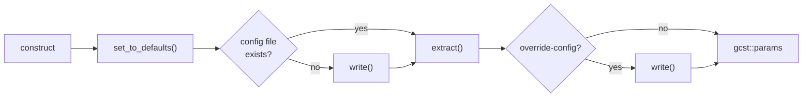

# Settings

<sub>[README](../README.md) · [Architecture](architecture.md) · [Building](build.md) · [Presets](presets.md) · [Local presets](local-presets.md) · [Dependencies](dependencies.md) · [CMake modules](cmake.md) · [CI](ci.md) · [Updating](updating.md) · [Scripting](scripting.md) · [Settings](settings.md)</sub>

`gcst::settings`, part of the `gcst::utils` library, collects an application's settings from three sources — built-in defaults, a config file and the command line — parses them with [CLI11](https://github.com/CLIUtils/CLI11) and keeps the result in `gcst::params`. Applications that need settings of their own extend it by inheritance.

- [Quick start](#quick-start)
- [Where values come from](#where-values-come-from)
- [Built-in settings](#built-in-settings)
- [The config file](#the-config-file)
- [Errors](#errors)
- [What `init()` does](#what-init-does)
- [Adding settings of your own](#adding-settings-of-your-own)
- [Reference](#reference)
- [Samples](#samples)

## Quick start

```cpp
#include <print>
#include <gcst/gcst.h>

int main(int argc, char** argv)
{
    if (auto r = gcst::settings::init(argc, argv); !r)
        return r.error();

    std::println("file-loglevel: {}", gcst::params->get("file-loglevel"));
}
```

```cmake
target_link_libraries(my_app PRIVATE gcst::utils)
```

`init()` must succeed before `gcst::params` is used — until then it is empty.

## Where values come from

Every setting starts with its default and can be overridden; a higher source wins:

| Priority | Source |
|---|---|
| 1 | Command line: `--file-loglevel debug` |
| 2 | Config file: `file-loglevel='warn'` |
| 3 | Default, set in `set_to_defaults()` |

## Built-in settings

| Key | Option | Default | Values |
|---|---|---|---|
| `logdir-path` | `-ldp`, `--logdir-path` | `logs/` next to the executable | any path; the directory is created after a successful parse |
| `file-loglevel` | `-fll`, `--file-loglevel` | `info` | `trace`, `debug`, `info`, `warn`, `error`, `critical` |
| `console-loglevel` | `-cll`, `--console-loglevel` | `info` | same as above |
| `override-config` | `-oc`, `--override-config` | `false` | flag: write the resulting values back to the config file |

Log levels are matched case-insensitively and stored as typed. Two more options are always there: `-h`, `--help` prints the option list, and `--config <file>` reads another config file instead of the default one.

## The config file

`settings.conf` next to the executable — `bin/settings.conf` for the programs of this repository. It holds one `key='value'` line per setting:

```toml
console-loglevel='info'
file-loglevel='info'
logdir-path='/home/user/my-project/bin/logs'
```

Values are TOML literal strings, so Windows paths with backslashes are read back unchanged. Keys a program doesn't know are ignored.

The file is written in two cases:

- **it doesn't exist** — on the first run it is created with the defaults;
- **`--override-config` is given** — the resulting values, command-line ones included, replace its contents. `override-config` itself is never written, so the flag doesn't stick.

## Errors

`init()` returns `gcst::etype`, which is `std::expected<int, int>`. When parsing fails — an unknown option, a value outside the allowed set — or `--help` is given, CLI11 prints its message and `init()` returns an error with code `1`. `gcst::params` is assigned only on success, so after a failed call it keeps whatever it held before.

```
$ ./bin/samples.BasicSettings --file-loglevel loud
--file-loglevel: loud not in {trace,debug,info,warn,error,critical}
Run with --help for more information.
$ echo $?
1
```

## What `init()` does



1. The object is constructed: the executable's directory and the config file path are computed, and a CLI11 parser is created.
2. `load()` runs the rest on the fully constructed object: defaults, the first-run config file, `extract()` — which registers the options and parses the command line together with the config file — and `--override-config`.
3. On success the object is moved into `gcst::params`.

Because everything after the constructor runs on a complete object, the virtual functions overridden in a [derived class](#adding-settings-of-your-own) are the ones that get called.

To give the parser a description of your own, pass a CLI11 app as the third argument; it is used instead of the default one:

```cpp
#include <CLI/CLI.hpp>

gcst::settings::init(argc, argv, std::make_shared <CLI::App> ("My application"));
```

## Adding settings of your own

Derive from `gcst::basic_settings`, passing your class as the template argument, and override what you need:

```cpp
// mysettings.h
#include <gcst/gcst.h>

class mysettings : public gcst::basic_settings <mysettings>
{
    protected:
        using basic_settings::basic_settings;

    public:
        void set_to_defaults() override;
        gcst::etype extract() override;
};
```

```cpp
// mysettings.cpp
#include "mysettings.h"
#include <CLI/CLI.hpp>

void mysettings::set_to_defaults()
{
    isettings::set_to_defaults();                              // keep the built-in settings
    this->set("level", "medium");                              // a plain default, given an option in extract()
    this->set("port", "8080", gcst::settings::type::option);   // registered as --port right away
}

gcst::etype mysettings::extract()
{
    this->cli->add_option("--level", this->dict["level"])
        ->check(CLI::IsMember({"low", "medium", "high"}, CLI::ignore_case));

    return isettings::extract();                               // built-in options, then parsing
}
```

```cpp
// main.cpp
if (auto r = mysettings::init(argc, argv); !r)
    return r.error();

gcst::params->get("port");
```

Rules for a derived class:

- **Inherit publicly** from `gcst::basic_settings<YourClass>`. The template argument tells `init()` which class to create; `gcst::settings` is simply `basic_settings<>` with nothing overridden.
- **Keep constructors `protected`, not `private`.** `init()` creates the object through a helper class derived from yours, and a private constructor is out of its reach. `using basic_settings::basic_settings;` is enough unless you need a [constructor of your own](#a-config-file-of-your-own).
- **Call the base versions to keep the built-in settings:** `isettings::set_to_defaults()`, and `isettings::extract()` **last** in your `extract()`. It does the parsing, so options added after it receive nothing.
- **Include `<CLI/CLI.hpp>`** to work with `this->cli` directly. `gcst::utils` passes CLI11 on to the targets linking it, so no extra CMake is needed.
- **Use `gcst::params`** to read the settings: it points to your class through the `isettings` interface, and your overrides apply.

### A config file of your own

Write a constructor and change `config_path` in its body. It runs after the base constructor has set the default path and before `init()` reads anything:

```cpp
protected:
    mysettings(int argc, char** argv, std::shared_ptr <CLI::App> cli = nullptr)
        : basic_settings(argc, argv, cli)
    {
        this->config_path = this->mydir / "mysettings.conf";
    }
```

## Reference

Names are declared in `gcst::utils` and brought into `gcst` by `<gcst/gcst.h>`.

| Name | Description |
|---|---|
| `isettings` | Abstract base with the interface below |
| `basic_settings<D = void>` | Class template that adds `static etype init(argc, argv[, cli])` — see [What `init()` does](#what-init-does). Derive from it to extend the settings |
| `settings` | `basic_settings<>`: the built-in settings with nothing overridden |
| `params` | `std::unique_ptr<isettings>` holding the settings after a successful `init()` |
| `etype` | `std::expected<int, int>` |

Public members of `isettings`:

| Member | Description |
|---|---|
| `std::string_view get(key)` | The current value. Throws `std::out_of_range` for an unknown key |
| `void set(key, value)` | Sets a value |
| `void set(key, value, type)` | Sets a value and registers `--<key>` with the parser as `type::option` or `type::flag` |
| `const std::map<std::string, std::string>& list()` | All keys and values |
| `virtual void set_to_defaults()` | Sets the default values |
| `virtual void write()` | Writes every value except `override-config` to the config file |
| `virtual void reset_to_defaults()` | `set_to_defaults()`, then `write()` |

Protected members, available to derived classes:

| Member | Description |
|---|---|
| `std::shared_ptr<CLI::App> cli` | The CLI11 parser |
| `std::map<std::string, std::string> dict` | The values; options bind to its entries |
| `fs::path mydir` | Directory of the running executable |
| `fs::path config_path` | Config file path, `mydir / "settings.conf"` by default |
| `virtual etype extract()` | Registers the built-in options and parses the command line and the config file |
| `virtual etype load()` | Everything `init()` does after construction |

## Samples

`samples/` holds two minimal programs, built with the rest of the project unless [`GCST_SAMPLES_BUILD`](build.md#samples) turns them off:

| Directory | Executable | Shows |
|---|---|---|
| `samples/basic_settings/` | `bin/samples.BasicSettings` | The built-in settings as they are |
| `samples/mysettings/` | `bin/samples.Mysettings` | A derived class adding `--port` and `--level` |

Both live in `bin/` and therefore share `bin/settings.conf`; keys one of them doesn't know are ignored by the other.
